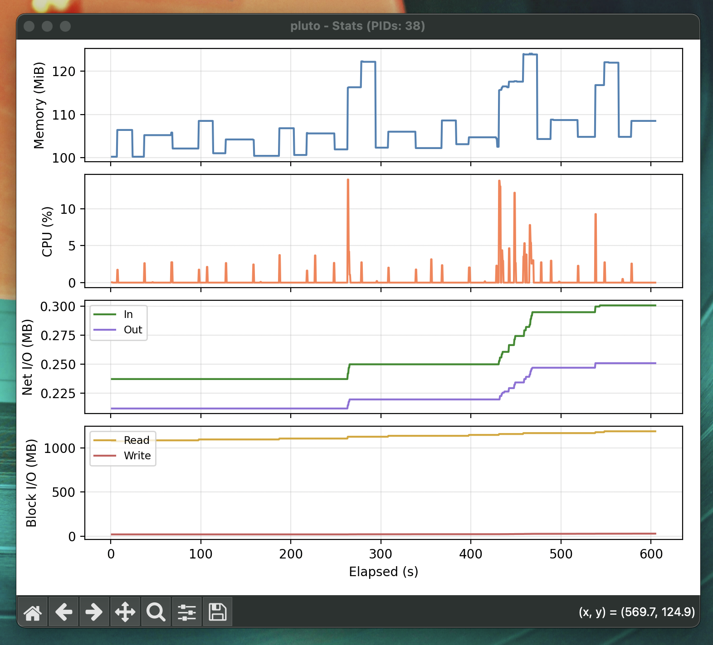

<p align="center">
  
</p>

# docker-monitor

Live Docker container resource monitoring with matplotlib.

## Getting Started

Copy and run the following command to get it running locally (assuming you have `uv` installed)

```sh
uv run https://raw.githubusercontent.com/danielronalds/docker-monitor/main/docker-monitor.py <container>
```

## Usage

```sh
# Run locally
uv run docker-monitor.py <container>

# Run directly from GitHub
uv run https://raw.githubusercontent.com/danielronalds/docker-monitor/main/docker-monitor.py <container>

# Show only specific stats
uv run docker-monitor.py <container> --cpu --memory
uv run docker-monitor.py <container> -c -n

# Show help
uv run docker-monitor.py --help
```

Outputs a live-updating chart with memory (MiB), CPU (%), Net I/O (MB), and Block I/O (MB) over time.
The current PID count is shown in the window title. Stats are also written to `stats.csv`.

### Flags

| Flag           | Short | Stat        |
|----------------|-------|-------------|
| `--cpu`        | `-c`  | CPU %       |
| `--memory`     | `-m`  | Memory MiB  |
| `--net-io`     | `-n`  | Net I/O MB  |
| `--block-io`   | `-b`  | Block I/O MB|

If no flags are provided, all stats are shown.

**Note:** This script is very vibecoded. This isn't supposed to be a proper tool, just a convenient script I made for future me
